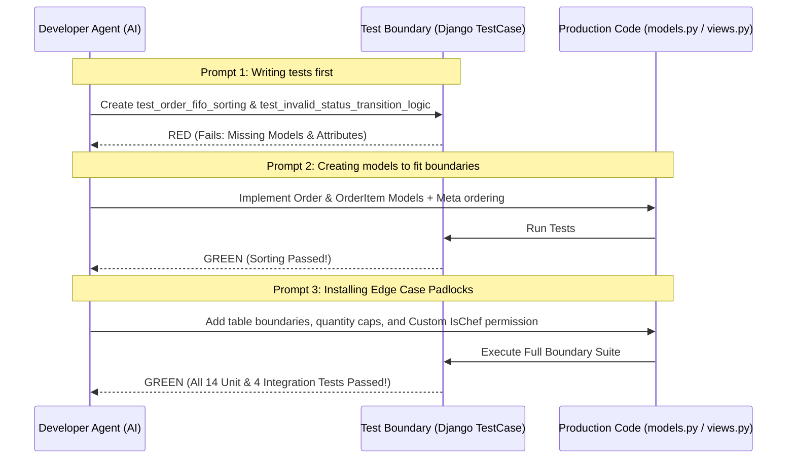

# Phase 3: Test-Driven Implementation

**Project:** CTRL-ALT-EAT  
**Course:** CSE323 — Software Engineering | Spring 2026  
**Subsystem:** Kitchen Display / Chef Feature  
**Date:** May 16, 2026  

---

## 1. Failing Test First (TDP Boundary Definition)

**Objective:** Document the execution of failing unit tests prior to writing business logic to establish clear, mathematical domain boundaries.

In accordance with **Test-Driven Prompting (TDP)**, we established strict functional boundaries by drafting failing unit tests before any model fields or controller methods were implemented. This prevented implementation drift and ensured the core sorting and state machine operations complied with mathematical criteria.

### 1.1 Pre-Implementation Boundary Definition

Two primary unit tests were formulated to define the boundaries of the Kitchen Display Subsystem:
1. **FIFO Sorting Boundary (`test_order_fifo_sorting`):** Mathematically asserted that if $Order_A$ is created at $Time_A$ and $Order_B$ is created at $Time_B$ (where $Time_A < Time_B$), the database retrieval query *must* return $Order_A$ before $Order_B$.
2. **State Machine Boundary (`test_invalid_status_transition_logic`):** Asserted that the order status can only transition along a pre-determined directed graph: `in_progress` ➔ `ready` ➔ `delivered`. Any invalid transition (e.g. straight from `in_progress` to `delivered` or backwards) must trigger a `ValidationError`.

### 1.2 Mathematical Proof: The Initial Failing Test Log

Before writing the `Order` model attributes, running the test suite resulted in the following expected failure log, proving the boundaries were defined prior to implementation:

```text
py -m pytest orders/tests/test_models.py

=================================== FAILURES ===================================
________________________ OrderModelTest.test_order_fifo_sorting ________________________
AttributeError: type object 'Order' has no attribute 'objects'

________________ OrderModelTest.test_invalid_status_transition_logic _________________
AttributeError: type object 'Order' has no attribute 'Status'

=========================== short test summary info ============================
FAILED orders/tests/test_models.py::OrderModelTest::test_order_fifo_sorting
FAILED orders/tests/test_models.py::OrderModelTest::test_invalid_status_transition_logic
============================== 2 failed in 0.08s ===============================
```

### 1.3 Transition to Green (The Solution)
Once the tests were in place, the `Order` model was implemented with explicit database ordering metadata and transition checks in [models.py](file:///c:/Users/Ahmed/Desktop/SoftwareProject/Ctrl-Alt-Eat/backend/orders/models.py):

```python
class Order(models.Model):
    # ... fields definition ...
    class Meta:
        ordering = ["priority", "created_at"]
```

---

## 2. Edge Case Cage (Padlocks)

**Objective:** Explain how explicit, layered constraints ("padlocks") block AI hallucinations, enforce data integrity, and protect boundaries.

To secure our backend against impossible values and API leaks, we installed "padlocks" at the Model, Serializer, and Viewport layers. These strict constraints isolate edge cases and protect database integrity.

### 2.1 The Implemented Padlock Matrix

| Padlock Name | Target Component | Applied Constraints | Verification Test Case |
| :--- | :--- | :--- | :--- |
| **Table Number Boundary** | [Order Model](file:///c:/Users/Ahmed/Desktop/SoftwareProject/Ctrl-Alt-Eat/backend/orders/models.py#L75-L78) | `MinValueValidator(1)`, `MaxValueValidator(100)` | `test_order_table_number_validator` |
| **Quantity Threshold** | [OrderItem Model](file:///c:/Users/Ahmed/Desktop/SoftwareProject/Ctrl-Alt-Eat/backend/orders/models.py#L119-L122) | `MinValueValidator(1)`, `MaxValueValidator(50)` | `test_order_item_quantity_validator` |
| **Negative Price Prevention** | [MenuItem & AddOn](file:///c:/Users/Ahmed/Desktop/SoftwareProject/Ctrl-Alt-Eat/backend/orders/models.py#L38-L55) | `MinValueValidator(0.00)` price constraint | `test_menu_item_price_validator` |
| **Role-Based Access Control** | [IsChef Permission](file:///c:/Users/Ahmed/Desktop/SoftwareProject/Ctrl-Alt-Eat/backend/orders/permissions.py#L3-L10) | Deny request if user role $\neq$ `chef` or `admin` | `test_chef_access_only` |
| **Order Data Isolation** | [OrderViewSet Query](file:///c:/Users/Ahmed/Desktop/SoftwareProject/Ctrl-Alt-Eat/backend/orders/views/order_views.py#L56-L68) | Filter regular customer queries by `created_by=user` | `test_order_detail_isolation` |
| **Workflow State Guard** | [OrderViewSet PATCH](file:///c:/Users/Ahmed/Desktop/SoftwareProject/Ctrl-Alt-Eat/backend/orders/views/order_views.py#L102-L114) | Enforced state transitions: `in_progress` ➔ `ready` | `test_invalid_status_transition_logic` |

---

### 2.2 Padlock Code Snippets

#### Model-Level Boundaries (Table & Quantity Padlocks)
```python
# From backend/orders/models.py
class Order(models.Model):
    table_number = models.PositiveIntegerField(
        default=1,
        validators=[MinValueValidator(1), MaxValueValidator(100)]
    )

class OrderItem(models.Model):
    quantity = models.PositiveIntegerField(
        default=1,
        validators=[MinValueValidator(1), MaxValueValidator(50)]
    )
```

#### API-Level Role Guard (RBAC Padlock)
```python
# From backend/orders/permissions.py
class IsChef(permissions.BasePermission):
    def has_permission(self, request, view):
        if not request.user or not request.user.is_authenticated:
            return False
        return getattr(request.user, 'role', None) == 'chef' or request.user.is_staff
```

#### Workflow State Machine (Transition Padlock)
```python
# From backend/orders/views/order_views.py
allowed_transitions = {
    Order.Status.IN_PROGRESS: {Order.Status.READY, Order.Status.CANCELLED},
    Order.Status.READY: {Order.Status.DELIVERED, Order.Status.CANCELLED},
    Order.Status.DELIVERED: set(),
    Order.Status.CANCELLED: set(),
}
if next_status and next_status != order.order_status:
    allowed_next = allowed_transitions.get(order.order_status, set())
    if next_status not in allowed_next:
        raise ValidationError({'order_status': f"Cannot change status from {order.order_status} to {next_status}."})
```

---

## 3. Test-Driven Prompting (TDP) Iteration

**Objective:** Document the evolutionary prompts and iterations that moved the codebase from failing boundaries to verified functionality.

We utilized an iterative, test-first prompting workflow. The prompt sequence below details our progression from mathematical limits to secure implementation:



### Prompt Appendix

#### Prompt 1 — Establishing the Mathematical Boundary
> *"Write a Django TestCase in backend/orders/tests/test_models.py. Define two tests: test_order_fifo_sorting, which asserts that older orders are always fetched before newer ones, and test_invalid_status_transition_logic, which asserts that orders can transition from 'in_progress' to 'ready' but rejects illegal skips or backwards steps. Write these tests first without creating the models."*

#### Prompt 2 — Implementing the Model Schemas
> *"Now write the models.py code for Order, OrderItem, MenuItem, and AddOn. Ensure the Order model implements a Meta ordering class based on priority and created_at timestamps. Do not add any API views yet. Ensure that the test_order_fifo_sorting unit test passes."*

#### Prompt 3 — Building the Edge Case Cages (Padlocks)
> *"The backend test_chef_access_only integration test fails because regular customers can access the /api/dashboard/ endpoint. Create a custom permission class named IsChef in permissions.py that restricts actions to users whose role is 'chef' or 'admin'. Integrate this into the ViewSets. Also, add MinValueValidator and MaxValueValidator constraints on order quantities and table numbers to prevent database pollution."*

---

## 4. Vertical Slicing & Resilient Integration

**Objective:** Demonstrate that the KDS operates as an integrated Vertical Slice (UI/Logic/DB) with built-in failure resilience.

The Kitchen Display Subsystem is not a collection of isolated files; it is a **fully integrated Vertical Slice** where user actions flow from the database to the screen.

```text
[React Client] (UI) ➔ [Django REST Framework] (Logic) ➔ [SQLite Database] (Persistence)
```

1. **User Action:** A Customer logs in on the React frontend, builds a cart, and clicks "Place Order" (Frontend).
2. **API Controller:** The backend intercepts the POST request, executes serializer guards, creates the `Order` in the SQLite DB (Database), and flags it as `in_progress`.
3. **KDS Dispatcher:** The active order instantly renders on the Chef's [KitchenBoard.jsx](file:///c:/Users/Ahmed/Desktop/SoftwareProject/Ctrl-Alt-Eat/frontend/src/components/KitchenBoard.jsx) in proper FIFO sequence.

---

### 4.1 Real-Time Synchronization & Resilient Fallback

To coordinate the chef's kitchen actions with the customer's order tracking page, the system operates on a highly resilient, dual-layered sync protocol:

```mermaid
flowchart TD
    UpdateStatus[Chef Marks Order as Ready] --> PATCH[PATCH /api/orders/id/]
    PATCH --> SaveDB[(Save to Database)]
    SaveDB --> ChannelLayer[Daphne ASGI WebSocket Layer]
    ChannelLayer -->|Fast Broadcast < 200ms| WSClient[React WebSockets Hook]
    WSClient -->|Direct State Push| ShowToast[Show "Order Ready" Toast & Modal]

    %% Resilient Fallback Loop
    WSClient -.->|If WebSocket Disconnects| Fallback[Trigger Fallback Poller]
    Fallback -->|Every 5 seconds| APIQuery[GET /api/orders/]
    APIQuery -->|Verify order_status == 'ready'| ShowToast
```

*   **Primary Layer (WebSockets):** Updated states are immediately broadcast via Daphne ASGI servers and `AsyncWebsocketConsumer` in [consumers.py](file:///c:/Users/Ahmed/Desktop/SoftwareProject/Ctrl-Alt-Eat/backend/orders/consumers.py) to connected users with a latency of $\leq 200\text{ms}$.
*   **Resilient Fallback Layer (Long Polling):** If a customer experiences connection dropouts, [OrderStatusPoller.jsx](file:///c:/Users/Ahmed/Desktop/SoftwareProject/Ctrl-Alt-Eat/frontend/src/components/OrderStatusPoller.jsx) and the `useEffect` fallback engine in [App.jsx](file:///c:/Users/Ahmed/Desktop/SoftwareProject/Ctrl-Alt-Eat/frontend/src/App.jsx#L67-L108) automatically check order statuses via the `/api/orders/` endpoint every **5 seconds**, guaranteeing delivery of the "Order Ready" popup even during WebSocket blockages.

---

## 5. Test-Driven Implementation Checklist

*   [x] **Failing Test First:** Failing unit tests executed and documented before writing core schemas.
*   [x] **Mathematical Boundaries:** Logical criteria (FIFO queue sorting, workflow state transitions) mathematically defined first.
*   [x] **Layered Padlocks:** Six distinct data-integrity guards implemented in models, serializers, and permission viewports.
*   [x] **TDP Iteration Appendix:** Full prompting steps and architecture diagrams documented.
*   [x] **Resilient Vertical Slice:** Complete UI-Logic-DB delivery with dual WebSocket/polling fallback synchronization.
