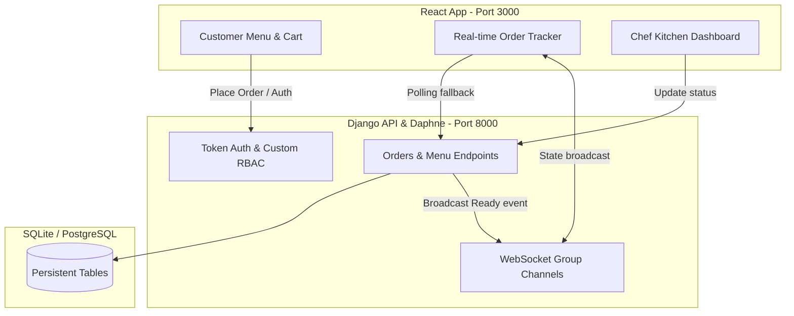

#  Ctrl-Alt-Eat: Kitchen Display System (KDS)

[](https://www.djangoproject.com/)
[](https://react.dev/)
[](https://tailwindcss.com/)
[](https://www.docker.com/)
[](https://playwright.dev/)

An advanced, premium-grade **Kitchen Display System (KDS)** and customer ordering solution. This system streamlines restaurant operations, replacing traditional handwritten tickets with a high-fidelity, real-time synchronization between the customer's front-of-house checkout flow and the kitchen's back-of-house dashboard.

---

## 🔗 Quick Access & Quick Links

| Platform / Portal | Environment | Local URL |
| :--- | :---: | :--- |
| **🌐 Customer Web Application** | Development | [http://localhost:3000](http://localhost:3000) |
| **🔑 Django Admin Portal** | Management | [http://localhost:8000/admin/](http://localhost:8000/admin/) |
| **⚡ Backend API Gateway** | API Specs | [http://localhost:8000/api/](http://localhost:8000/api/) |
| **📹 Walkthrough Video** | Live Demo | [demo/video_link.txt](file:///c:/Users/Ahmed/Desktop/SoftwareProject/Ctrl-Alt-Eat/demo/video_link.txt) |

> [!NOTE]
> Ensure both the backend API and frontend servers are running to access the links above.

---

## 👥 Seeded Test Accounts

To speed up testing and evaluation, the database is pre-seeded with the following credentials. Use these accounts to experience the role-based dashboard states:

| Role | Username / Email | Password | Allowed Access |
| :--- | :--- | :--- | :--- |
| **👑 Administrator** | `admin` | `admin123` | Django Admin Portal, full database control |
| **👨‍🍳 Chef / Kitchen Staff** | `chef@ejust.edu.eg` | `chef123` | Kitchen Dashboard, Order Status transitions |
| **🍔 Customer** | `abdulrehmanadil491@gmail.com` | `123456` | Menu Browsing, Cart addition, Checkout, Order Tracking |

---

## ✨ System Features

### 🛒 Customer Experience
- **Category-Based Menu:** Sleek visual breakdown of menu items (Main Meals, Drinks, Desserts).
- **Interactive Cart & Custom Add-ons:** Seamlessly add items, adjust quantities, and select specific additions (e.g. Extra Cheese, Mushrooms, Double Patty) with live price updates.
- **Session-based Authentication:** Secure sign-up and log-in with immediate role-based interface adjustments.
- **Real-time Order Tracking:** Interactive timeline showing status changes from **In Progress** ➔ **Ready** ➔ **Delivered**.
- **Automated Alerts:** High-contrast desktop and modal alerts triggered immediately via WebSockets when the customer's order is prepared by the chef.

### 🍳 Chef Dashboard (KDS)
- **FIFO Sorting Queue:** Active orders are automatically arranged oldest-to-newest to ensure fair, rapid service.
- **High-Contrast Cards:** Designed for fast-paced kitchens with large table numbers, color-coded status badges, item counts, and special notes.
- **One-Click Status Lifecycle:** Move orders seamlessly from `in_progress` to `ready`, and `delivered`.
- **Dynamic Workload Counters:** Live metrics showing active orders count to help the team manage high-volume rush hours.

### 🔒 Administration & Security
- **Role-Based Access Control (RBAC):** Custom Django permission guards (`IsChef`) and frontend route protection ensure customers cannot access or manipulate the kitchen dashboard.
- **Strict Data Boundaries:** Mathematical constraints on inputs (e.g., negative item counts or invalid table numbers are strictly blocked).

---

## 🛠️ Tech Stack & Architecture

- **Frontend:** React (hooks, context API, state-management) styled with Tailwind CSS for premium look and feel.
- **Backend:** Django Web Framework with Django REST Framework (DRF) for standard JSON API endpoints.
- **Real-Time Layer:** Django Channels (ASGI server) supporting WebSockets for immediate state push updates.
- **Database:** SQLite (development) with robust model constraints.
- **Testing Suite:** Pytest + Django TestCase for backend integration tests, and Playwright for E2E user journey flows.



---

## 🚀 Setup & Installation

You can run the system using **Docker Compose** (recommended) or **locally on your machine**.

### Option A: Using Docker (Highly Recommended)
Ensure you have Docker and Docker Compose installed, then run:

```bash
# 1. Build and boot the application containers
docker-compose up --build

# The backend will automatically apply migrations and seed the database.
# Access the Customer Web App at: http://localhost:3000
# Access the Django Admin Portal at: http://localhost:8000/admin/
```

---

### Option B: Local Manual Setup

#### 1. Backend Setup
```bash
# Move to the backend folder
cd backend

# Create a virtual environment and activate it
python -m venv venv
# On Windows:
venv\Scripts\activate
# On macOS/Linux:
source venv/bin/activate

# Install required dependencies
pip install -r requirements.txt

# Run migrations
python manage.py migrate

# Seed the database with menu items and test credentials
python seed_data.py

# Launch the server
python manage.py runserver
# The API will be active at http://localhost:8000/api/
```

#### 2. Frontend Setup
```bash
# Open a new terminal window, move to the frontend folder
cd frontend

# Install package dependencies
npm install

# Launch the React dev server
npm start
# The site will load at http://localhost:3000/
```

---

## 🧪 Testing & Validation

We enforce a strict **70/20/10 Testing Pyramid** (70% Unit Tests, 20% Integration Tests, 10% E2E UI Tests) to guarantee mathematical correctness and seamless workflows.

### 🐍 Backend Tests (Unit & Integration)
We run 18+ high-coverage unit tests checking model validations, FIFO sorting mechanics, and custom permissions.
```bash
cd backend
python manage.py test orders.tests
```

### 🎭 Frontend Tests (Playwright E2E Master Journeys)
Our Playwright suite tests full workflow scenarios (empty state handling, server error resistance, status updates) utilizing the **Page Object Model (POM)** pattern.
```bash
cd frontend
# Run tests in headless mode
npx playwright test

# Or run with visual browser UI
npx playwright test --ui
```

---

## 📂 Project Structure

```text
Ctrl-Alt-Eat/
├── backend/                   # Django REST Framework backend
│   ├── kitchen_display/       # Core project settings and routing
│   ├── orders/                # Main application logic (Models, Views, Serializers)
│   │   ├── tests/             # Backend Unit & Integration tests
│   │   ├── views/             # Split views (Auth, Order, Dashboard, Status)
│   │   └── models.py          # Database Schema & strict boundary validators
│   ├── manage.py
│   └── seed_data.py           # Preloaded catalog & test accounts
├── frontend/                  # React + Tailwind CSS client
│   ├── public/                
│   ├── src/                   
│   │   ├── components/        # Reusable UI widgets (Navbar, Toast, Custom Icons)
│   │   ├── context/           # Auth and Cart state providers
│   │   ├── pages/             # Dashboard, Login, OrderHistory, CreateOrder, Checkout
│   │   └── services/          # API Axios handlers
│   ├── tests/                 # Playwright E2E UI tests (using POM)
│   └── package.json           
├── docs/                      # Architectural requirements & System specification
├── demo/                      # Demonstration scripts & video references
├── docker-compose.yml         # Container configuration orchestration
└── README.md                  # This file
```

---

## 🎓 Academic Credit & Context
This project was developed as a term project for the **CSE323 — Software Engineering** course.

**Team Members:**
- **Adnan Ahmed** - 120230008
- **Mohamed Ashraf** - 120230056
- **Ahmed El-Shazly** - 120230062
- **Abdelrahman Adel** - 120230073
- **Seif Fayed** - 120230091

---
*Created with ❤️ by Ctrl-Alt-Eat Team.*