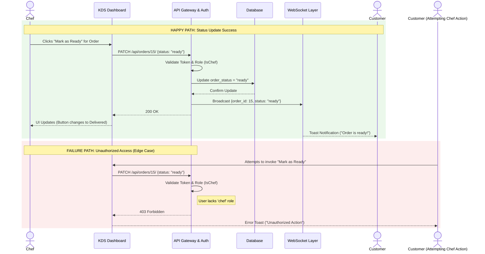
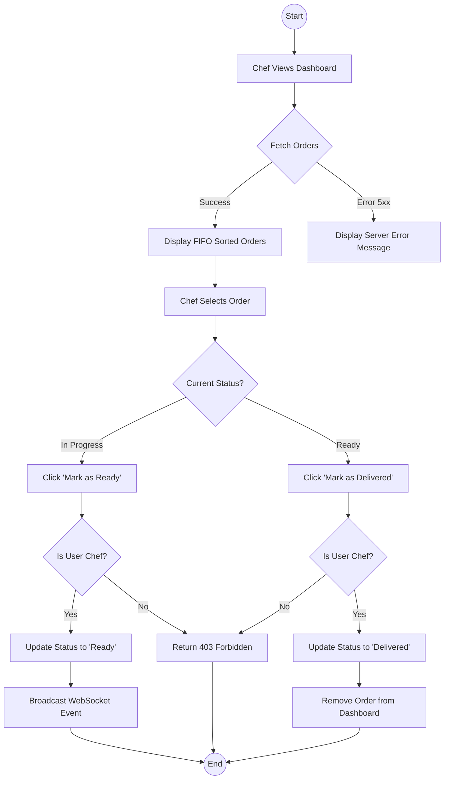

# UML Diagrams

## 1. System Sequence Diagram (SSD) — Happy & Failure Paths

This SSD illustrates the interaction between the Chef and the Kitchen Display System (KDS) when updating an order status, including both successful processing and an authentication failure scenario.

## 2. Activity Diagram — Order State Machine

This diagram maps the code decision points for the order lifecycle management, demonstrating where edge cases are blocked (Padlocks).

