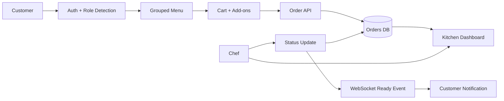

# D2 Requirements Report

## Kitchen Display System (KDS)

**Course:** CSE323 - Software Engineering  
**Project:** Ctrl-Alt-Eat Kitchen Display System  
**Subsystem:** Kitchen Display System with customer ordering support  
**Team Members:**  
- Adnan Ahmed - 120230008
- Mohamed Ashraf - 120230056
- Ahmed El-Shazly - 120230062
- Abdelrahman Adel - 120230073
- Seif Fayed - 120230091

---

## 1. Introduction

The Kitchen Display System is the operational part of the Ctrl-Alt-Eat restaurant application. Its main job is to move customer orders from the menu/cart flow into a live kitchen dashboard where chefs can prepare orders in arrival order and update their status. The system reduces the need for handwritten tickets or verbal communication between the front side of the restaurant and the kitchen.

The current implementation uses a React frontend and a Django REST Framework backend. Customers can sign up, browse menu items, select add-ons, place an order for a table, and track their order. Chefs can view active orders in FIFO order and update them from `in_progress` to `ready`, then to `delivered`. WebSocket notifications are used for ready-order alerts, with frontend filtering so customers only see notifications for their own orders.

The scope of this report is limited to Phase 1: requirement discovery and traceability. It does not evaluate the full design or validation deliverables except where tests are useful as traceability evidence.

---

## 2. Actor Classification

### 2.1 Primary Actors

Primary actors directly use the system to complete their own goals.

| Actor | Description | Responsibilities | Why This Classification Fits |
|---|---|---|---|
| Customer | A restaurant customer using the web interface to order food. | Create/login to an account, browse menu categories, choose add-ons, manage cart, submit orders, track status, view history. | The customer starts the main business flow by creating an order. Without this actor, the kitchen board has no incoming work. |
| Chef / Kitchen Staff | A kitchen user responsible for preparing and completing orders. | Monitor live orders, read item details and notes, mark orders as ready, mark ready orders as delivered. | This actor receives the main output of the ordering flow and uses the dashboard to perform kitchen work. |

### 2.2 Supporting Actors

Supporting actors provide services that help the primary actors complete their goals.

| Actor | Description | Responsibilities | Why This Classification Fits |
|---|---|---|---|
| Authentication Service | The Django token authentication layer used by the API and frontend. | Validate login credentials, issue tokens, support logout and `/auth/me/` session checks. | It supports customer and chef access but does not use the KDS for its own business goal. |
| Database | The persistence layer behind Django models. | Store users, roles, menu items, add-ons, orders, order items, and order status. | It supports all flows by keeping system state consistent across requests. |
| WebSocket Channel Layer | Django Channels in-memory channel layer. | Broadcast order-ready events to connected clients. | It supports real-time feedback, but it is not a human user of the system. |
| React Frontend | The browser application used by customers and chefs. | Route users by role, collect input, display menus/orders, call APIs, show errors and notifications. | It mediates interaction between users and backend services. |

### 2.3 Offstage Actors

Offstage actors care about the outcome but are not directly part of the main runtime workflow.

| Actor | Description | Responsibilities / Interest | Why This Classification Fits |
|---|---|---|---|
| Restaurant Manager / Admin | A manager who needs the restaurant to process orders correctly. | Maintain menu data, observe order flow, rely on accurate kitchen operation. | The implementation includes admin/staff roles and Django admin support, but the manager is not the main dashboard user. |
| Cashier / Payment Role | A possible restaurant role around payments and checkout. | Care about payment method selection and completed orders. | A `cashier` role exists in the model and payment method UI exists, but there is no complete cashier workflow in this subsystem. |
| IT / System Maintainer | Person responsible for deployment and backend configuration. | Configure API URL, CORS, database, server process, and WebSocket runtime. | They support operation but do not participate in order preparation. |
| Course Evaluator | The grader reviewing whether requirements, traceability, and edge cases are properly documented. | Inspect submitted reports and implementation evidence. | This actor influences documentation quality but is not part of the restaurant workflow. |

---

## 3. Functional Requirements

The following requirements are extracted only from the implemented project. They avoid features that are not present in the code.

| ID | Requirement | Priority | Related Actor(s) | Implementation Evidence |
|---|---|---:|---|---|
| FR-01 | The system shall allow users to sign up and log in using email/password credentials. | High | Customer, Chef | `SignupSerializer`, `LoginSerializer`, `SignupView`, `LoginView`, `AuthContext` |
| FR-02 | The system shall classify a new user as `chef` when the email ends with `@ejust.edu.eg`; otherwise the user is a `customer`. | High | Customer, Chef | `SignupSerializer.create`, `Login.jsx` detected role preview, `Auth.test.jsx` |
| FR-03 | The frontend shall protect routes based on user role. | High | Customer, Chef | `ProtectedRoute` in `App.jsx`, customer and chef route definitions |
| FR-04 | The system shall expose menu items grouped by category, including available add-ons. | High | Customer | `MenuItemViewSet.list`, `MenuItem`, `AddOn`, `CreateOrder.jsx` |
| FR-05 | Customers shall be able to add menu items to a cart with quantities and selected add-ons. | High | Customer | `CartContext.jsx`, `CreateOrder.jsx`, `Cart.test.jsx` |
| FR-06 | Customers shall be able to place an order containing table number and cart items. | High | Customer, Database | `OrderCreateSerializer`, `OrderViewSet.create`, `Cart.jsx`, `CheckoutPage.jsx` |
| FR-07 | The backend shall store each order with its creator, table number, items, quantities, add-ons, notes, status, priority, and creation time. | High | Customer, Chef, Database | `Order`, `OrderItem`, `OrderSerializer` |
| FR-08 | Customers shall only see their own orders through the orders API and order history page. | High | Customer | `OrderViewSet.get_queryset`, `OrderHistory.jsx`, integration test |
| FR-09 | Chefs shall see active kitchen orders in FIFO order. | High | Chef | `DashboardViewSet.get_queryset`, `Dashboard.jsx`, `KitchenBoard.jsx` |
| FR-10 | Chefs shall update order status from `in_progress` to `ready`, then from `ready` to `delivered`. | High | Chef, Customer | `OrderViewSet.partial_update`, `StatusButtons.jsx`, integration tests |
| FR-11 | Customers shall receive a ready-order notification for their own order. | Medium | Customer, WebSocket Channel | `OrderConsumer`, `useOrderSocket`, `App.jsx` customer-id filtering, `Toast.jsx` |
| FR-12 | The system shall validate key order boundaries: table number 1-100, item quantity 1-50, non-negative prices, and note length. | High | Customer, Chef, Database | Django validators in `models.py`, serializer validation tests |
| FR-13 | The UI shall handle empty cart, empty menu category, and empty kitchen queue states. | Medium | Customer, Chef | `Cart.jsx`, `CreateOrder.jsx`, `KitchenBoard.jsx` |
| FR-14 | The system shall support logout and token/session cleanup on the frontend. | Medium | Customer, Chef | `LogoutView`, `AuthContext.logout`, `Navbar.jsx` |
| FR-15 | The checkout UI shall allow selecting a demo payment method before placing an order, without processing real payment. | Low | Customer, Cashier | `PaymentOptions.jsx`, `Cart.jsx`, `CheckoutPage.jsx` |

---

## 4. Traceability Heatmap / Matrix

Legend: `H = strong direct evidence`, `M = partial evidence`, `L = weak/supporting evidence`, `- = not applicable`.

| Req ID | Feature / Behavior | UI Screen or Component | API / Backend | Database Entities | Tests / Evidence | Coverage |
|---|---|---|---|---|---|---|
| FR-01 | Signup/login | `Login.jsx` | `/api/auth/signup/`, `/api/auth/login/` | `User`, `Token` | `test_signup_api`, `test_login_api`, `Auth.test.jsx` | H |
| FR-02 | Role detection | `Login.jsx` role preview | `SignupSerializer.create` | `User.role` | `test_signup_serializer_customer`, `test_signup_serializer_chef`, `Auth.test.jsx` | H |
| FR-03 | Role routing | `App.jsx`, `Navbar.jsx` | Authenticated API calls | `User.role` | Frontend context tests indirectly | M |
| FR-04 | Menu browsing | `CreateOrder.jsx` | `GET /api/menu-items/` | `MenuItem`, `AddOn` | `test_menu_items_api` | H |
| FR-05 | Cart management | `CreateOrder.jsx`, `Cart.jsx` | - | Browser state only | `Cart.test.jsx` | H |
| FR-06 | Order submission | `Cart.jsx`, `CheckoutPage.jsx` | `POST /api/orders/` | `Order`, `OrderItem` | `test_create_order_authenticated`, serializer tests | H |
| FR-07 | Order persistence | Kitchen/order screens | `OrderSerializer` | `Order`, `OrderItem`, `MenuItem`, `AddOn`, `User` | `test_order_model`, `test_order_item_model` | H |
| FR-08 | Customer order isolation | `OrderHistory.jsx` | `OrderViewSet.get_queryset` | `Order.created_by` | `test_customer_cannot_see_others_orders` | H |
| FR-09 | FIFO kitchen dashboard | `Dashboard.jsx`, `KitchenBoard.jsx` | `GET /api/dashboard/` | `Order.created_at`, `Order.order_status` | Integration tests support endpoint access | M |
| FR-10 | Status workflow | `StatusButtons.jsx` | `PATCH /api/orders/{id}/` | `Order.order_status` | `test_chef_can_update_status`, access-control tests | H |
| FR-11 | Ready notification | `Toast.jsx`, `ReadyNotification.jsx` | `ws/orders/`, group broadcast | `Order.created_by_id` in event | `test_order_ready_broadcast` | M |
| FR-12 | Boundary validation | Forms and API errors | Serializers/models | `Order`, `OrderItem`, `MenuItem`, `AddOn` | Model and serializer boundary tests | H |
| FR-13 | Empty states | `Cart.jsx`, `CreateOrder.jsx`, `KitchenBoard.jsx` | - | - | Manual/UI evidence in components | M |
| FR-14 | Logout/session cleanup | `Navbar.jsx` | `/api/auth/logout/`, `/api/auth/me/` | `Token`, `User` | Auth context tests partly cover state changes | M |
| FR-15 | Demo payment choice | `PaymentOptions.jsx` | Not persisted | - | UI component evidence only | L |

### 4.1 Requirement-to-Implementation Diagram

### 4.2 Orphan Check

| Item Checked | Result |
|---|---|
| Requirements without implementation evidence | None in this D2 report. Low evidence is clearly marked instead of hidden. |
| Implemented features without requirement mapping | Payment method UI is mapped as FR-15 and marked low because it is UI-only. |
| Features with missing tests | Route protection, empty UI states, FIFO ordering, and demo payment selection would benefit from more frontend/e2e tests. |
| Requirements that are outside current implementation | Real payment processing, cashier dashboard, printer integration, and production-grade WebSocket auth are intentionally not claimed. |

---

## 5. Persona Discovery

### Persona 1: Omar, Busy Lunch Customer

Omar is a student ordering food between classes. He wants to select a meal quickly, avoid waiting at the counter, and know when the order is ready. He is comfortable using a web app but will not read long instructions. His main pain point is uncertainty: he dislikes not knowing whether the kitchen actually received the order.

### Persona 2: Sara, Line Chef

Sara works during peak hours and needs a simple board that shows the oldest active orders first. She cares about table number, item details, add-ons, and special notes. Her pain point is missed modifications, especially when several orders arrive at once.

### Persona 3: Mina, Restaurant Supervisor

Mina is responsible for keeping service moving. He is not always the person touching the dashboard, but he cares about bottlenecks, stuck orders, wrong role access, and whether the system can recover from common failures.

### 5.1 Hidden Requirements and Edge Cases

| ID | Edge Case / Hidden Requirement | Scenario | Risk | Current Handling | Limitation |
|---|---|---|---|---|---|
| EC-01 | Unauthorized order status update | A customer tries to call `PATCH /api/orders/{id}/` and mark their own order ready. | Fake ready states and broken kitchen trust. | Backend blocks status updates unless the user is chef/admin/staff; frontend also restricts chef dashboard routes. | More negative frontend tests would improve evidence. |
| EC-02 | Customer opens kitchen dashboard API | A logged-in customer manually requests `/api/dashboard/`. | Customer can see other tables or kitchen workload. | Backend returns 403 for non-kitchen staff. | This should remain covered in integration tests after future changes. |
| EC-03 | Lost WebSocket connection | A customer's browser disconnects before the order becomes ready. | Customer may miss the ready alert. | `useOrderSocket` reconnects after 3 seconds, and the tracking page polls order status. | WebSocket auth is still simple; production would use authenticated per-user groups. |
| EC-04 | Notification broadcast to unrelated customers | Multiple customers are connected when one order becomes ready. | Wrong customer receives a ready message. | The frontend checks `event.customer_id` against the logged-in user id before showing a toast. | The event is still broadcast to a shared group, but it does not include item details. |
| EC-05 | Simultaneous status changes | Two kitchen users click status buttons on the same order almost at the same time. | Order could skip states or end in a confusing status. | Backend status-transition rules only allow valid next states. | There is no optimistic locking/version field, so the last valid request still wins. |
| EC-06 | Duplicate order submission | A customer double-clicks or retries during slow network. | Same cart may be submitted twice. | UI disables the submit button while a request is in progress. | There is no backend idempotency key, so refresh/retry duplicates are still possible. |
| EC-07 | Invalid table number or quantity | User submits table `0`, table `101`, quantity `0`, or quantity `51`. | Bad kitchen tickets or impossible values in reports. | Django validators and serializer tests reject invalid boundaries. | Frontend validation is lighter than backend validation, so API remains the main guard. |
| EC-08 | Empty queue / empty cart / empty category | The kitchen has no active orders, the cart is empty, or a category has no items. | User may think the app is broken. | Components show specific empty states and navigation actions. | Empty states are manually implemented but not fully covered by e2e tests. |
| EC-09 | Kitchen overload | Many orders arrive during rush hour. | Chefs may lose the preparation order or miss long-waiting tickets. | Dashboard sorts FIFO and shows active counts plus waiting time. | No automatic escalation, SLA timer, or priority override UI exists yet. |
| EC-10 | Weak role proof through email domain | A user signs up with an `@ejust.edu.eg` address and becomes chef. | If email ownership is not verified, role assignment can be abused. | The implementation uses email-domain detection as required by the demo flow. | A real deployment should require admin approval or verified institutional login. |

---

## 6. Requirement Coverage Evaluation

For Phase 1, the project is now close to the rubric's Excellent band:

| Rubric Criterion | Evaluation |
|---|---|
| Actor Classification | All three actor types are identified with rationale. Primary, supporting, and offstage actors are separated clearly. |
| Traceability Heatmap | Every requirement in this report maps to implementation evidence. The matrix also marks weak/partial areas instead of overstating them. |
| Persona Discovery | More than five edge cases are derived from realistic customer, chef, and supervisor personas. Each case includes scenario, risk, current handling, and limitation. |

The main remaining weakness is not the D2 report itself, but test depth around frontend route protection, empty-state UI, and production-grade WebSocket scoping. These are documented honestly and do not require inventing features that are absent from the project.

---

## 7. Conclusion

The Kitchen Display System implements a practical vertical slice for restaurant order handling: customers submit orders, the kitchen receives active tickets, chefs update status, and customers receive readiness feedback. The requirements can be traced through React screens, Django APIs, database models, and available tests. A few production features are intentionally outside the current scope, but the core Phase 1 requirements are now documented with clear actor classification, traceability, and persona-driven edge cases.
